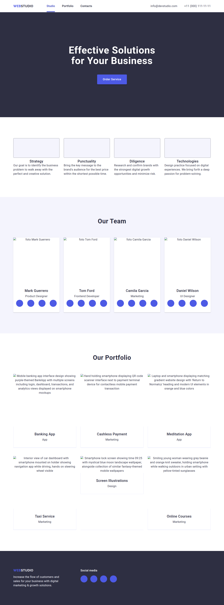

# CSS Classes from HTML

🚀 **Автоматична генерація CSS класів з HTML файлів з інтеграцією Figma**

<!-- AUTOGEN:STATS -->
[](https://developer.mozilla.org/en-US/docs/Web/JavaScript) [](https://developer.mozilla.org/en-US/docs/Web/HTML) [](https://code.visualstudio.com/) [](https://github.com/) [](https://www.figma.com/) [](https://support.apple.com/guide/terminal/welcome/mac) 

[](https://github.com/VuToV-Mykola/css-classes-from-html/graphs/traffic)
[](https://github.com/VuToV-Mykola/css-classes-from-html/actions/workflows/screenshot-and-visitor.yaml)
[](https://github.com/VuToV-Mykola/css-classes-from-html)
[](https://github.com/VuToV-Mykola/css-classes-from-html/blob/main/LICENSE)
[](https://github.com/VuToV-Mykola/css-classes-from-html/releases)

## 📸 Latest Screenshot

<!-- END:AUTOGEN -->
[](https://youtu.be/xl46PGWNB3A)

## ✨ Особливості

- 🎯 **Автоматичне витягування CSS класів** з HTML файлів
- 🎨 **Інтеграція з Figma** для отримання дизайн-токенів
- 📱 **Адаптивний дизайн** з медіа-запитами
- 🌙 **Підтримка темної теми**
- 🏗️ **Сучасний CSS** з коментарями українською/англійською
- ⚡ **Швидкий доступ** через контекстне меню та гарячі клавіші

## 🚀 Встановлення

1. Відкрийте VS Code
2. Перейдіть до Extensions (`Ctrl+Shift+X`)
3. Шукайте "CSS Classes from HTML"
4. Натисніть "Install"

## 🎮 Використання

### Швидкий старт

1. **Відкрийте HTML файл** у VS Code
2. **Виберіть текст** або залиште весь файл
3. **Використайте один з способів**:
   - 🔥 **Гарячі клавіші**: `Ctrl+Shift+H`
   - 🖱️ **Контекстне меню**: Правий клік → "Generate CSS from HTML"
   - 🎯 **Command Palette**: `Ctrl+Shift+P` → "Generate CSS from HTML"

### З інтеграцією Figma

1. Запустіть команду генерації CSS
2. Введіть посилання на макет Figma (опціонально)
3. Введіть токен доступу Figma (опціонально)
4. Отримайте CSS з дизайн-токенами!

## ⚙️ Налаштування

Відкрийте Settings (`Ctrl+,`) та шукайте "CSS Classes from HTML":

### 🎨 Основні налаштування
```json
{
  "cssclasssfromhtml.language": "uk",           // Мова коментарів: "uk" або "en"
  "cssclasssfromhtml.includeGlobal": true,      // Включити глобальні стилі
  "cssclasssfromhtml.includeReset": true,       // Включити CSS reset
  "cssclasssfromhtml.responsive": true,         // Генерувати адаптивні стилі
  "cssclasssfromhtml.darkMode": true,           // Підтримка темної теми
  "cssclasssfromhtml.cssVariables": true,       // Використовувати CSS змінні
  "cssclasssfromhtml.includeComments": true     // Включити коментарі
}
```

### 🔧 Розширені налаштування
```json
{
  "cssclasssfromhtml.autoSave": true,                    // Автозбереження CSS
  "cssclasssfromhtml.outputPath": "./css/styles.css",   // Шлях для збереження
  "cssclasssfromhtml.minify": false,                     // Мініфікація CSS
  "cssclasssfromhtml.indentSize": 2,                     // Розмір відступів
  "cssclasssfromhtml.colorFormat": "hex",               // Формат кольорів
  "cssclasssfromhtml.sortProperties": true,              // Сортування властивостей
  "cssclasssfromhtml.prefixClasses": ""                  // Префікс для класів
}
```

### 📱 Налаштування адаптивності
```json
{
  "cssclasssfromhtml.breakpoints": {
    "mobile": "320px",
    "tablet": "768px", 
    "desktop": "1158px"
  }
}
```

## 🎨 Figma інтеграція

### 🔑 Налаштування токена доступу

**Спосіб 1: Через налаштування VSCode (рекомендовано)**
1. Відкрийте Settings (`Ctrl+,`)
2. Шукайте "CSS Classes from HTML"
3. Знайдіть поле "Figma Token"
4. Вставте ваш токен доступу
5. Токен буде збережено та використовуватиметься автоматично

**Спосіб 2: Введення при кожному використанні**
- Просто залиште поле токена порожнім у налаштуваннях
- Розширення запитає токен при генерації CSS

### 🎯 Отримання токена доступу

1. Увійдіть в обліковий запис [Figma](https://www.figma.com/)
2. Перейдіть до **Settings** → **Account** → **Personal access tokens**
3. Натисніть **Create new token**
4. Дайте назву токену (наприклад, "VSCode Extension")
5. Скопіюйте згенерований токен
6. Вставте в налаштування VSCode або використовуйте при запиті

⚠️ **Важливо**: Зберігайте токен у безпеці та не діліться ним з іншими!

### 📋 Налаштування токена через settings.json
```json
{
  "cssclasssfromhtml.figmaToken": "figd_ваш_токен_тут"
}
```

### 🎨 Підготовка макету

- Використовуйте консистентні назви для кольорів
- Створюйте текстові стилі з зрозумілими назвами  
- Використовуйте компоненти для повторюваних елементів
- Організовуйте елементи в логічні групи
- Використовуйте Auto Layout для адаптивних компонентів

## 📝 Приклади використання

### 🎯 Базовий приклад

**HTML:**
```html
<div class="hero">
  <h1 class="hero-title">Welcome</h1>
  <button class="hero-btn">Click me</button>
</div>
```

**Згенерований CSS (стандартні налаштування):**
```css
/* !!! AUTO-GENERATED CSS FROM HTML !!! */

/* !!! Стилі для класу hero !!! */
.hero {
  /* Властивості макету */
  background-color: var(--color-dark, #2e2f42);
  color: var(--color-white, #fff);
  text-align: center;
  padding: 120px 0;
}

/* !!! Стилі для класу hero-title !!! */
.hero-title {
  /* Властивості типографіки */
  font-size: var(--size-h1, 56px);
  font-weight: var(--weight-bold, 700);
  margin-bottom: 48px;
}

/* !!! Стилі для класу hero-btn !!! */
.hero-btn {
  /* Властивості макету */
  background-color: var(--color-primary, #4d5ae5);
  color: var(--color-white, #fff);
  border-radius: 4px;
  padding: 16px 32px;
  border: none;
  cursor: pointer;
}

.hero-btn:hover {
  background-color: var(--color-hover, #404bbf);
}

/* TABLET: 768px and up */
@media (min-width: 768px) {
  .hero-title {
    font-size: clamp(36px, 4vw, 56px);
  }
}
```

### ⚙️ З розширеними налаштуваннями

**Налаштування:**
```json
{
  "cssclasssfromhtml.prefixClasses": "app-",
  "cssclasssfromhtml.colorFormat": "rgb",
  "cssclasssfromhtml.includeComments": false,
  "cssclasssfromhtml.minify": true,
  "cssclasssfromhtml.cssVariables": false
}
```

**Результат:**
```css
.app-hero{background-color:rgb(46,47,66);color:rgb(255,255,255);text-align:center;padding:120px 0}.app-hero-title{font-size:56px;font-weight:700;margin-bottom:48px}.app-hero-btn{background-color:rgb(77,90,229);border:none;border-radius:4px;color:rgb(255,255,255);cursor:pointer;padding:16px 32px}.app-hero-btn:hover{background-color:rgb(64,75,191)}@media (min-width:768px){.app-hero-title{font-size:clamp(36px,4vw,56px)}}
```

### 🎨 З Figma інтеграцією

**Налаштування токена:**
```json
{
  "cssclasssfromhtml.figmaToken": "figd_ваш_токен_тут"
}
```

**Результат з дизайн-токенами:**
```css
:root {
  /* Colors from Figma */
  --primary-blue: #4d5ae5;
  --navy-blue: #2e2f42;
  --cloud-white: #f4f4fd;
  --cornflower: #e7e9fc;
  
  /* Typography from Figma */
  --font-roboto: 'Roboto', sans-serif;
  --font-raleway: 'Raleway', sans-serif;
  --heading-large: 56px;
  --heading-medium: 36px;
}

.hero {
  background-color: var(--navy-blue);
  color: var(--cloud-white);
  font-family: var(--font-roboto);
}

.hero-title {
  font-size: var(--heading-large);
  font-family: var(--font-raleway);
}
```

## 🔧 Команди та гарячі клавіші

| Команда | Опис | Гарячі клавіші | Контекстне меню |
|---------|------|----------------|------------------|
| `Generate CSS from HTML` | Генерує CSS з HTML файлу | `Ctrl+Shift+H` | ✅ (тільки для .html) |
| `Command Palette` | Доступ через палітру команд | `Ctrl+Shift+P` | ✅ |

### 🎯 Способи запуску

1. **Гарячі клавіші**: `Ctrl+Shift+H` (найшвидший)
2. **Контекстне меню**: Правий клік на HTML файлі → "Generate CSS from HTML"
3. **Command Palette**: `Ctrl+Shift+P` → введіть "Generate CSS"
4. **Меню редактора**: Правий клік у відкритому HTML файлі

## 🌟 Підтримувані функції

### 🎯 Основні можливості
- ✅ Витягування CSS класів з HTML
- ✅ Генерація базових стилів
- ✅ Псевдо-класи (:hover, :focus, :active)
- ✅ Медіа-запити для адаптивності
- ✅ CSS змінні (custom properties)
- ✅ Коментарі українською та англійською
- ✅ Контекстне меню для HTML файлів
- ✅ Гарячі клавіші

### 🎨 Figma інтеграція
- ✅ Збереження токена доступу в налаштуваннях
- ✅ Автоматичне витягування дизайн-токенів
- ✅ Синхронізація кольорів та типографіки
- ✅ Підтримка компонентів та стилів
- ✅ Експорт breakpoints з макету

### ⚙️ Розширені налаштування
- ✅ Автозбереження згенерованого CSS
- ✅ Налаштування шляху збереження
- ✅ Мініфікація CSS коду
- ✅ Сортування CSS властивостей
- ✅ Різні формати кольорів (hex, rgb, hsl, var)
- ✅ Налаштування розміру відступів
- ✅ Префікси для CSS класів
- ✅ Кастомні breakpoints

## 🐛 Відомі обмеження

- Потрібен активний редактор з HTML контентом
- Figma токен потрібен для повної інтеграції (можна зберегти в налаштуваннях)
- Генерує тільки базові стилі (не складну логіку)
- Токен Figma зберігається локально в налаштуваннях VSCode
- Для роботи з Figma API потрібне інтернет-з'єднання

## 📋 Системні вимоги

- **VS Code**: версія 1.74.0 або новіша
- **Операційна система**: Windows, macOS, Linux
- **Інтернет з'єднання**: потрібне для Figma інтеграції
- **Права доступу**: можливість читання/запису файлів у робочій папці
- **Пам'ять**: мінімум 50MB вільного місця для розширення

## 🤝 Внесок у розвиток

1. Fork репозиторій
2. Створіть feature branch
3. Зробіть зміни
4. Створіть Pull Request

## 📄 Ліцензія

MIT License - дивіться [LICENSE.md](LICENSE.md)

## 👨‍💻 Автор

**VuToV-Mykola**
- GitHub: [@VuToV-Mykola](https://github.com/VuToV-Mykola)
- Email: vutov.mykola@gmail.com

## 🔗 Корисні посилання

### 📚 Документація
- [Документація VS Code API](https://code.visualstudio.com/api)
- [Figma API Documentation](https://www.figma.com/developers/api)
- [CSS Custom Properties](https://developer.mozilla.org/en-US/docs/Web/CSS/--*)
- [CSS Media Queries](https://developer.mozilla.org/en-US/docs/Web/CSS/Media_Queries)

### 🛠️ Інструменти
- [Figma Personal Access Tokens](https://www.figma.com/settings)
- [CSS Validator](https://jigsaw.w3.org/css-validator/)
- [Can I Use](https://caniuse.com/) - перевірка підтримки CSS

### 🎨 Дизайн ресурси
- [Figma Community](https://www.figma.com/community)
- [Design Tokens](https://designtokens.org/)
- [Material Design](https://material.io/design)

## 🆕 Що нового в версії 0.0.5

- ✨ **Збереження токена Figma** в налаштуваннях VSCode
- 🎛️ **Розширені налаштування** для кастомізації генерації
- 🎨 **Підтримка різних форматів кольорів** (hex, rgb, hsl, var)
- 📁 **Автозбереження** згенерованого CSS
- 🔧 **Мінімізація CSS** та сортування властивостей
- 📐 **Кастомні breakpoints** для адаптивного дизайну
- 🏷️ **Префікси для CSS класів**
- ⚙️ **Налаштування розміру відступів**

---

⭐ **Подобається розширення? Поставте зірочку на GitHub!**

💡 **Є ідеї для покращення?** Створіть [Issue](https://github.com/VuToV-Mykola/css-classes-from-html/issues) або [Pull Request](https://github.com/VuToV-Mykola/css-classes-from-html/pulls)!
