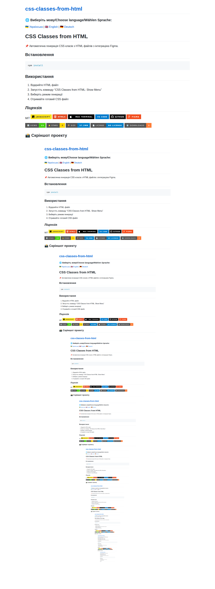

# 🎨 CSS Classes from HTML

### 🌐 Виберіть мову/Choose language/Wählen Sprache:
[🇺🇦 Українська](README.md) | [🇬🇧 English](docs/README.en.md) | [🇩🇪 Deutsch](docs/README.de.md)

<!-- AUTOGEN:STATS -->
[](https://developer.mozilla.org/en-US/docs/Web/JavaScript) [](https://developer.mozilla.org/en-US/docs/Web/HTML) [](https://support.apple.com/guide/terminal/welcome/mac) [](https://code.visualstudio.com/) [](https://github.com/) [](https://www.figma.com/) 

[](https://github.com/VuToV-Mykola/css-classes-from-html/graphs/traffic)
[](https://github.com/VuToV-Mykola/css-classes-from-html/actions/workflows/screenshot-and-visitor.yaml)
[](https://github.com/VuToV-Mykola/css-classes-from-html)
[](https://github.com/VuToV-Mykola/css-classes-from-html/blob/main/LICENSE)
[](https://github.com/VuToV-Mykola/css-classes-from-html/releases)

## 📸 Скріншот проекту

<!-- END:AUTOGEN -->

## 📊 Статистика Marketplace:
[](https://marketplace.visualstudio.com/items?itemName=vutov-mykola.css-classes-from-html)
[](https://github.com/VuToV-Mykola/css-classes-from-html/blob/HEAD/LICENSE.md)
[](https://marketplace.visualstudio.com/items?itemName=vutov-mykola.css-classes-from-html)
[](https://marketplace.visualstudio.com/items?itemName=vutov-mykola.css-classes-from-html)
[](https://github.com/VuToV-Mykola/css-classes-from-html)

## 📹 Відео інструкція

[](https://youtu.be/xl46PGWNB3A)

**[🎬 Дивитися повну інструкцію на YouTube](https://youtu.be/xl46PGWNB3A)**

## 💖 Підтримати автора

[](https://www.paypal.com/donate/?hosted_button_id=D5U6TQ3Q9CVLS)
[](https://www.paypal.com/donate/?hosted_button_id=D5U6TQ3Q9CVLS)

> Якщо це розширення допомогло вам у роботі, підтримайте автора кавою! ☕

## 📌 Опис

**CSS Classes from HTML** — це потужне розширення для Visual Studio Code, яке автоматично генерує CSS класи з HTML файлів з можливістю реальної інтеграції з Figma дизайнами. Розроблено з використанням знань, отриманих на курсах GoIT, та за допомогою штучного інтелекту.

## ✨ Основні можливості

### 🚀 Три режими генерації
- **⚡ Мінімальний** - Швидка генерація базових CSS класів
- **🎯 Максимальний** - Повна інтеграція з Figma з розумним співставленням
- **📦 Production** - Оптимізований CSS для продакшн середовища

### 🎨 Реальна Figma інтеграція
- **🔗 API Integration** - Пряма робота з Figma API без mock даних
- **📋 Canvas Selection** - Вибір конкретних Canvas для обробки
- **🎨 Layer Analysis** - Детальний аналіз кожного Layer
- **💎 Smart Matching** - Розумне співставлення Figma елементів з HTML класами

### 📦 Імпорт ресурсів
- **🖼️ Image Import** - Автоматичне завантаження та оптимізація зображень
- **🔤 Font Import** - Інтеграція з Google Fonts та імпорт шрифтів
- **🎨 SVG Sprites** - Генерація оптимізованих SVG спрайтів
- **📂 Asset Organization** - Автоматична організація файлів

### 🧠 Розумні алгоритми
- **📊 Hierarchical Analysis** - Аналіз ієрархії HTML та Figma
- **🏷️ Semantic Recognition** - Автоматичне визначення семантичних ролей
- **📝 Text Matching** - Співставлення за текстовим контентом
- **📈 Confidence Scoring** - Оцінка впевненості співставлення

## 📦 Встановлення

### Спосіб 1: З VS Code Marketplace
```bash
code --install-extension vutov-mykola.css-classes-from-html
```

### Спосіб 2: З VSIX файлу
1. Завантажте `.vsix` файл з [Releases](https://github.com/VuToV-Mykola/css-classes-from-html/releases)
2. У VS Code: `Ctrl+Shift+P` → `Extensions: Install from VSIX...`
3. Виберіть завантажений файл

### Спосіб 3: З вихідного коду
```bash
git clone https://github.com/VuToV-Mykola/css-classes-from-html.git
cd css-classes-from-html
npm install
bash scripts/deploy.sh
```

## 🚀 Використання

### Швидкий старт
1. Відкрийте HTML файл у VS Code
2. Натисніть `Ctrl+Shift+C` (Windows/Linux) або `Cmd+Shift+C` (Mac)
3. Виберіть режим генерації:
   - **Мінімальний**: Базові CSS класи без Figma
   - **Максимальний**: Повна інтеграція з Figma
   - **Production**: Оптимізований код
4. CSS файл буде створено автоматично!

### З Figma інтеграцією
1. **Налаштування токену:**
   - Отримайте [Figma Personal Access Token](https://www.figma.com/developers/api#access-tokens)
   - Вставте токен у розширення

2. **Підключення файлу:**
   - Скопіюйте посилання на Figma файл
   - Вставте у поле "Figma File URL"

3. **Вибір контенту:**
   - Натисніть "Load Canvas" для завантаження Canvas
   - Виберіть потрібні Canvas та Layers
   - Опціонально імпортуйте зображення та шрифти

4. **Генерація CSS:**
   - Натисніть "Generate CSS"
   - Отримайте розумний CSS з реальними стилями з Figma

## ⌨️ Горячі клавіші

| Команда | Windows/Linux | Mac | Опис |
|---------|---------------|-----|------|
| Показати меню | `Ctrl+Shift+C` | `Cmd+Shift+C` | Відкрити головне меню |
| Швидка генерація | `Ctrl+Alt+C` | `Cmd+Alt+C` | Мінімальна генерація CSS |

## 📊 Приклад результату

```css
/* ✅ CSS Generated by Smart CSS Generator v0.0.7 */
/* Generated: 2025-01-15 12:30:45 */
/* Matched: 15 | Unmatched: 3 | Accuracy: 83.3% */

/* ✅ MATCHED: Figma "Hero Title" (TEXT) → HTML .hero-title */
/* Confidence: 95.2% | Strategy: smart-matching */
.hero-title {
  font-family: 'Inter', sans-serif;
  font-size: 48px;
  font-weight: 700;
  color: #1a1a1a;
  line-height: 56px;
  letter-spacing: -0.02em;
}

/* ✅ MATCHED: Figma "Primary Button" (RECTANGLE) → HTML .btn-primary */
/* Confidence: 89.7% | Strategy: semantic-match */
.btn-primary {
  background-color: #007ACC;
  color: #ffffff;
  border-radius: 8px;
  padding: 12px 24px 12px 24px;
  border: none;
  cursor: pointer;
  transition: background-color 0.2s ease;
}

/* ❌ UNMATCHED: No Figma element found for .card */
.card {
  /* Add styles manually */
}

/* ✅ RESPONSIVE STYLES */
@media (max-width: 768px) {
  .hero-title {
    font-size: 32px;
    line-height: 40px;
  }
}
```

## ⚙️ Налаштування

### Режими роботи
- `minimal`: Базова генерація CSS класів без Figma інтеграції
- `maximum`: Повна інтеграція з Figma, розумне співставлення елементів
- `production`: Оптимізований та мініфікований CSS

### Опції генерації
- `includeReset`: Включити reset стилі (за замовчуванням: true)
- `includeComments`: Додати коментарі про співставлення (за замовчуванням: true)
- `optimizeCSS`: Оптимізувати CSS для продакшн (за замовчуванням: false)
- `generateResponsive`: Генерувати адаптивні стилі (за замовчуванням: true)

### Figma налаштування
- **API Token**: Персональний токен доступу з Figma
- **File URL**: Посилання на Figma файл
- **Canvas Selection**: Вибрані Canvas для обробки
- **Layer Selection**: Конкретні Layers для співставлення

## 🛠️ Розробка

### Структура проєкту
```
css-classes-from-html/
├── backend/                    # Backend модулі
│   ├── core/                  # Основні компоненти
│   │   ├── FigmaAPIClient.js
│   │   ├── HTMLParser.js
│   │   └── IntegrationEngine.js
│   ├── generators/            # CSS генератори
│   │   └── SmartCSSGenerator.js
│   ├── utils/                 # Утиліти
│   │   ├── ImageImporter.js
│   │   └── FontImporter.js
│   └── matchers/              # Алгоритми співставлення
├── frontend/                  # WebView інтерфейс
├── scripts/                   # Скрипти розгортання та тестування
├── logs/                      # Логи системи
├── builds/                    # Збірки VSIX
├── backups/                   # Резервні копії
└── debugs/                    # Debug файли
```

### Команди розробки
```bash
# Тестування
bash scripts/tests.sh

# Налагодження
bash scripts/debug.sh

# Розгортання
bash scripts/deploy.sh

# Пуш на GitHub
bash scripts/push-to-github.sh
```

### Запуск в режимі розробки
1. Відкрийте проєкт у VS Code
2. Натисніть `F5` для запуску Extension Development Host
3. У новому вікні VS Code протестуйте розширення

## 🧪 Тестування

Проєкт включає комплексну систему тестування:

- **Unit тести** - Тестування окремих модулів
- **Integration тести** - Тестування взаємодії компонентів  
- **Debug тести** - Налагодження та діагностика
- **Performance тести** - Тестування продуктивності

```bash
# Запуск всіх тестів
bash scripts/tests.sh

# Запуск debug тестів
bash scripts/debug.sh
```

## 🐛 Troubleshooting

### Поширені проблеми

**Figma API помилки:**
- Перевірте валідність токену
- Переконайтеся що файл публічний або у вас є доступ
- Токен повинен мати права на читання файлів

**Проблеми зі співставленням:**
- Використовуйте осмислені назви класів у HTML
- Давайте зрозумілі назви Layers у Figma
- Структуруйте HTML семантично

**Помилки генерації CSS:**
- Перевірте синтаксис HTML файлу
- Переконайтеся що VS Code має доступ до файлу
- Перевірте логи в Output Channel

### Логи та діагностика
- **Output Channel**: "CSS Classes from HTML" у VS Code
- **Debug файли**: `debugs/` директорія
- **Лог файли**: `logs/` директорія

## 📝 Ліцензія

MIT License - дивіться файл [LICENSE](LICENSE)

## 👨‍💻 Автор

**VuToV-Mykola**
- GitHub: [@VuToV-Mykola](https://github.com/VuToV-Mykola)
- Email: vutov_nikola@icloud.com

## 🙏 Подяки

- [GoIT](https://goit.global) - за знання та навчання
- Anthropic Claude AI - за допомогу в розробці
- VS Code Team - за чудовий редактор та API
- Figma Team - за потужний API для дизайну

## 🤝 Внесок у проєкт

Внески вітаються! Дивіться [CONTRIBUTING.md](docs/CONTRIBUTING.md) для деталей.

### Як допомогти
1. 🐛 [Повідомте про баг](https://github.com/VuToV-Mykola/css-classes-from-html/issues)
2. 💡 [Запропонуйте функцію](https://github.com/VuToV-Mykola/css-classes-from-html/discussions)
3. 📖 Покращте документацію
4. 🧪 Додайте тести
5. ⭐ Поставте зірку проєкту

## 🔗 Корисні посилання

- [VS Code Marketplace](https://marketplace.visualstudio.com/items?itemName=vutov-mykola.css-classes-from-html)
- [GitHub Repository](https://github.com/VuToV-Mykola/css-classes-from-html)
- [Figma API Documentation](https://www.figma.com/developers/api)
- [Video Tutorial](https://youtu.be/xl46PGWNB3A)

---

**Розроблено з ❤️ в Україні 🇺🇦**